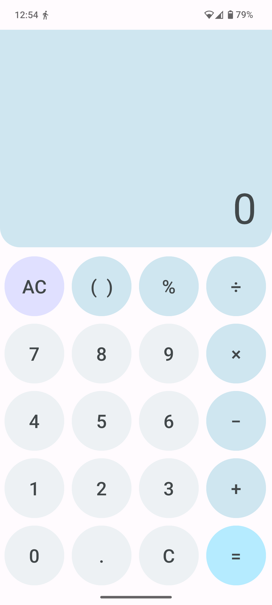
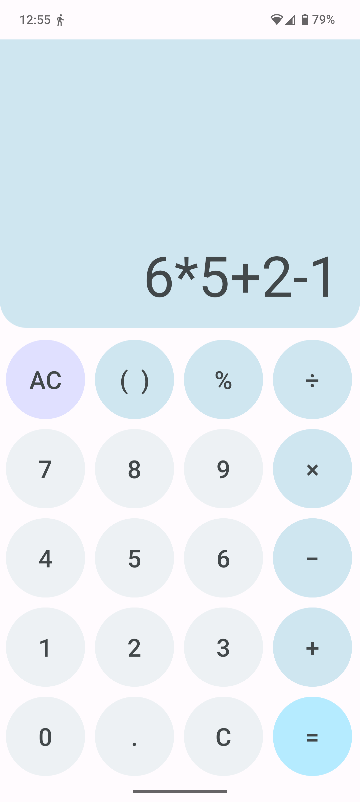

<image src="./app/src/main/ic_launcher-playstore.png" height="150" />

<h1 align="center">Simple Calc</h1>

Simple Calc is a simple calcuator made with Java for Android 7.0 and forward, built to add, substract, multiply and divide.

## Features

- Standard Calculator functionaloity with simple comands as add, divide, substract, multiply and divide.
- Complete precision over calculations.
- Lightweight size. It weights less than 1mb (APK size).

## Screenshots

    
    

## License

Liscensed under the [GPLv3](https://www.gnu.org/licenses/gpl-3.0.en.html) liscense.
